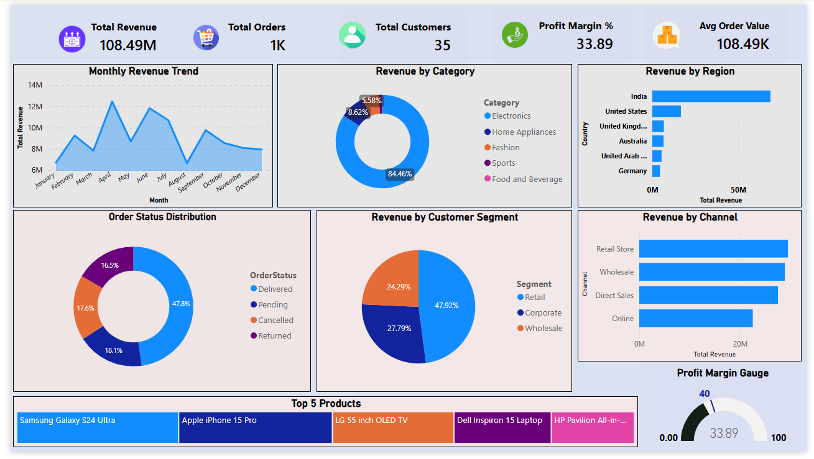

# sales-performance-intelligence-hub
End-to-End Business Analytics Dashboard using SQL, Power BI, DAX

# 📊 Sales Performance Intelligence Hub

An end-to-end Business Analytics Dashboard built using 
PostgreSQL, Power BI, DAX, and Advanced Excel.

## 🔗 Live Dashboard
[Click here to view Dashboard](#) ← Add Power BI link here

## 📌 Project Overview
Analyzed 1,000+ sales orders across 10 global regions 
to build an executive-level dashboard.

## 🛠️ Tools Used
- PostgreSQL — SQL queries, JOINs, CTEs, Window Functions
- Power BI Desktop — 9 interactive visuals
- DAX — 6 custom measures
- Advanced Excel — PivotTable analysis

## 📊 Dashboard Features
- 5 Executive KPIs
- Monthly Revenue Trend
- Sales by Category Donut
- Global Regional Map
- Top 5 Products Treemap
- Customer Segment Analysis
- Order Status Distribution
- Profit Margin Gauge

## 📁 Dataset
- 4 tables: Orders(1000), Customers(35), Products(35), Regions(10)
- 5 product categories across 10 global regions

## 📸 Dashboard Preview

